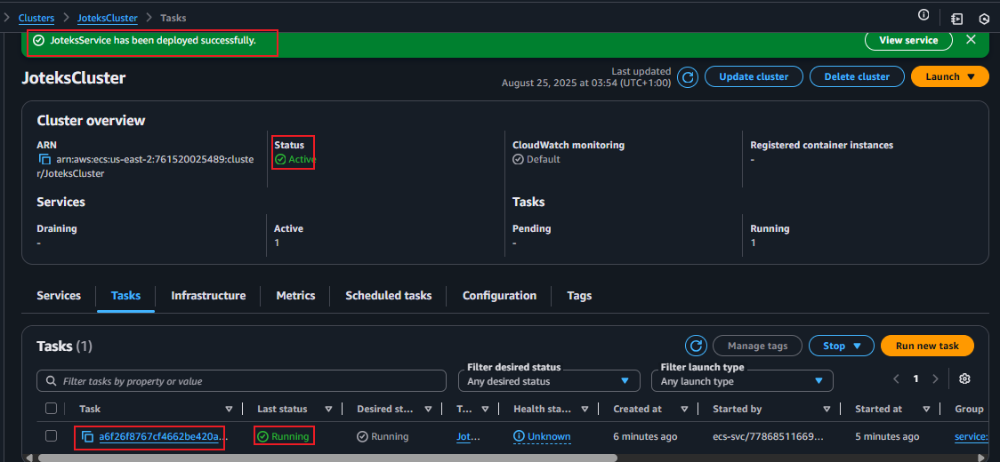

# ✈️ Joteks Travels – Containerized Website on AWS

This project showcases how I containerized a static website for Joteks Travels using Docker, Amazon EC2, ECS (Fargate).  
It demonstrates skills in cloud deployment, containerization, and GitHub project documentation.

📂 **Project Structure**

🚀 **Deployment Steps**

### 1️⃣ Local Deployment
 

- Created `index.html` with vibrant travel-themed design.  

 

Perfect 👍

Let’s set up your Dockerfile.

This Dockerfile will:

1. Use nginx (lightweight web server).

2. Copy your index.html and assets/ folder into the container.

2. Serve your travel website automatically when you run the container. 

-  `Dockerfile` to containerize the app.

- Added company logo in `assets/logo.png`.

**Build Docker image:**

docker build -t joteks-travels .

       
Run Docker container:
docker run -d -p 80:80 joteks-travels

Access in browser via localhost:

http://localhost:80

### 2️⃣ GitHub Setup

Initialized Git repository.

Pushed project files to GitHub.

Cloned Repo

### 3️⃣ AWS Deployment

 EC2 Deployment

Launched EC2 instance (Amazon Linux 2/2023).

Connected using SSH / Instance Connect.

Installed Docker & Git.

Docker run

Built Docker image on EC2 and ran the container.

Docker login

Docker push to EC2/ECR

Accessed website via EC2 public IP
 
http://3.21.171.103/

### ECS / Fargate Deployment

#### Created ECS cluster (Fargate).

#### Defined Task Definition with container image bettym72/joteks-travels:latest.

#### Deployed service

 

Accessed website via Fargate Service public IP 

 
http://3.145.147.162/

🛠️ Tech Stack

Frontend: HTML, CSS, JS

Containerization: Docker

Cloud Provider: AWS (EC2, ECR, ECS, Fargate, ALB)

Version Control: Git & GitHub

✍️ Author

👩‍💻 Betty Musari
Aspiring Cloud & DevOps Engineer

# Joteks-travels
Joteks Travels & Tours – A travel booking website containerized with Docker and deployed on AWS ECS with an Application Load Balancer. Showcases DevOps workflows including containerization, cloud deployment, and load balancing as part of a portfolio project.

